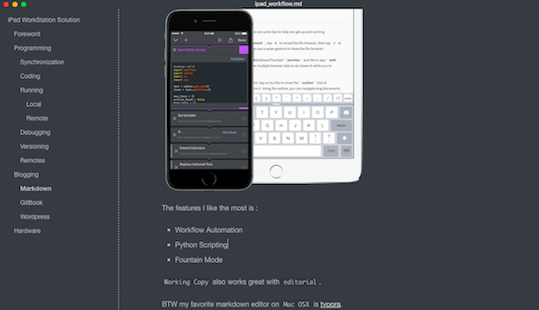

# iPad WorkStation Solution

## Foreword
I've always been trying to find a solution to work with my iPad Mini (un-jailbreak). 

For me the requirements of working on iPad are shown as follow:

- Programming
  - Coding
  - Running
  - Deploying
  - Debugging


- Blogging
  - Write
  - Publish
  - Manager


## Programming

I am a programmer and my work is like :

-   80% Game Develop 
    -   80% Client Side
    -   20% Server Side
-   20% Software / Tool Develop

So being able to do some programming on my iPad is the most important requirement.

### Synchronization

In most cases we will not start a whole project on our mobile device we only want to modify a project that we already set up some where else.

So how to import the projects is one of the import feature for the `App` that we choose to use.

For me, my choice here is [textastic](http://www.textasticapp.com/).

 

It supports import projects from `Dropbox` && `iCloud Drive` and that is enough for me.


### Coding

After importing the projects, then we can start to code.

Basically, to code on iPad, we only need a text editor with syntax highlights support.

There are tons of text editor Apps out there in the AppStore nowadays so just pick the one you like.

And off course we can code offline there is no need for network except when you want to synchronize the project again.


### Running

After coding our project, it will be great if we can run it locally and see how it works.

But remeber, usually this only work for  web project that use `html` + `javascript` + `css`.

For me, being able to run `Cocos2d-JS` based game is a big satisfaction.

#### Local

Now lots of text editor have in app `PREVIEW` feature for us to quickly run our web project so this should not be difficult.

Demo in textastic:


And usually this works even offline so it is a cool feature for us.

#### Remote

In this case we will need network and a server to store our project, will talk about this in the following section.


### Debugging

Most of the time being able to run the project is still not enough, we would like to be able to debug the project — at least able to see some `Log` from the project.

And with the help of [firebug-lite](http://getfirebug.com/firebuglite) this should be really easy.

Just add a line to our `index.html` like :

```html
<script type="text/javascript" src="https://getfirebug.com/firebug-lite.js"></script>
```

and a nice yet powerful console we popup and we'll be able to see the log there:


BTW, textastic have integrated the firebug-lite so we can enabled it easily.


### Versioning

Having our project hosted in `Dropbox` && `iCloud Drive` is one choice but most of time we will host our project somewhere with version control, say GitHub.

So we will need a `Git` client to help us to deal with our projects.

After trying several Git Apps my final choice  [Working Copy, Git on iOS](http://workingcopyapp.com/).


First of all, it has all the features I need or even more with Git projects :

-   init
-   Clone
-   Push / Commit (Paid)
-   Fetch
-   Diff
-   Merge

And the workflows for all the features listed above are the best among all the Apps I've tried.

Secondly, the in app code editor / preview feature is almost as good as textastic (except the virtual keyboard).

Thirdly, it works perfectly with `textastic` , I can open a file in `textastic` , edit it, get back to `WorkingCopy` and the modifications are updated automatically and all I need is to diff / commit / push.


### Remotes

Sometimes being able to work locally is just not enough, for example if our project is a server side project based on `PHP`, `Python` or `node.js`, then we to deploy it somewhere so we can run it remotely.

If you have a personal server and have root access to it then it would be easy since you can deploy it on your own server and all you need is a good FTP/SSH App and here my choice is [prompt 2](https://www.panic.com/prompt/).

If you do not have a personal server than you can use some popular [PaaS](https://en.wikipedia.org/wiki/Platform_as_a_service) such as :

-   [Heroku](https://www.heroku.com/)
-   [Google App Engine](https://cloud.google.com/appengine/)
-   [Amazon Web Services](http://aws.amazon.com/)
-   …...

We can deploy our server side project on these site and then work with the git repository using `Working Copy` app .

You can see how to quickly set up a serve side project with `Node.js` + `Express` [here](https://devcenter.heroku.com/articles/getting-started-with-nodejs).

And after that we can clone the repository into `Working Copy`


## Blogging

Besides programming, the next important requirement for me is blogging.

I like to record my learning experience and share it with the other developers around the world.

### Markdown

The most popular way to write stuffs nowadays and also a bunch of Apps out there in the AppStore.

My choice here is [editorial](http://omz-software.com/editorial/).

 

The features I like the most is :

-   Workflow Automation
-   Python Scripting
-   Fountain Mode

`Working Copy` also works great with `editorial`.

BTW my favorite markdown editor on `Mac OSX` is [typora](http://www.typora.io/).

 

### GitBook

[GitBook](https://www.gitbook.com/@supersuraccoon/) is one place that I love to publish my post.

The way I choose to publish book on GitBook is : `GitHub Hosting`.

>   You can see a post about this [here](https://www.gitbook.com/book/supersuraccoon/gitbook_multilanguage_template/details).

Since I host my GitBook source code on `GitHub`, my workflow is:

-   Clone the repository for my book in `GitHub` using `Working Copy`
-   Writing with `editorial` since  `Working Copy` works great with it
-   Diff / Commit / Push
-   Check my book using `Safari` or any browsers since there is no app for `GitBook` on mobile yet


### Wordpress

I have a [personal wordpress blog](http://www.supersuraccoon-cocos2d.com) that I've been running for 5 years so this is another place I will publish my post.

I use the official [Wordpress](https://itunes.apple.com/us/app/wordpress/id335703880?mt=8) app to manager my site.


and using the `Wp-Admin` ( in browser ) to publish post ( in markdown format ).

 


## Hardware

No matter how good a vitural keyboard is it still can not beat a real keyboard.

To code and blog more effectively a keyboard is indispensable.

For me the most important point is portability and then typing feel.

So, a foldable bluetooth keyboard is my best [chooice](http://www.iectechnology.com/product/best-ultra-slim-mini-wireless-foldable-bluetooth-keyboard.html).

 


