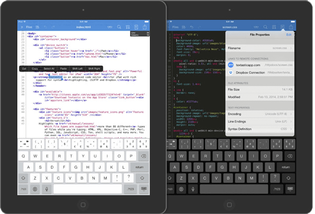
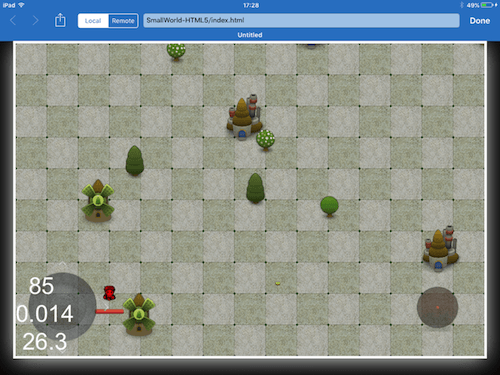
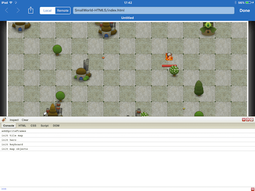
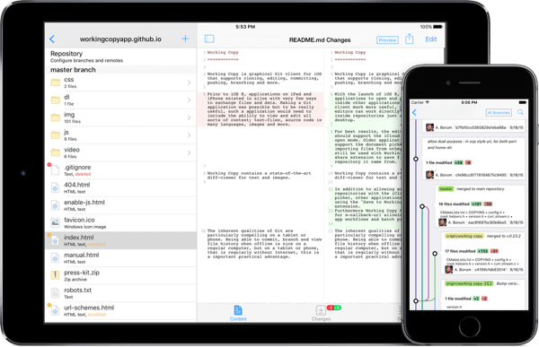
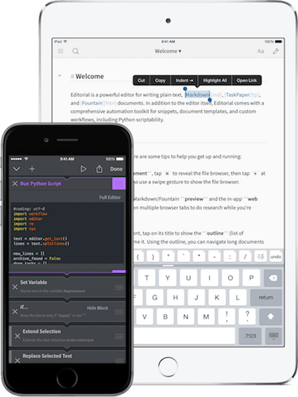
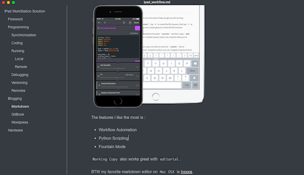
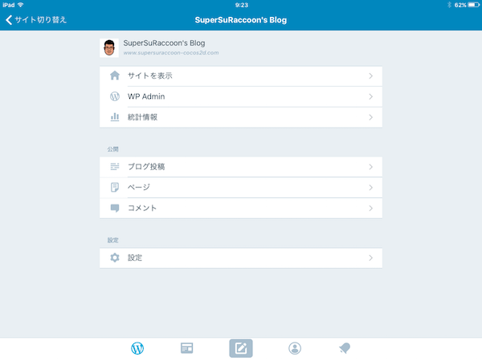
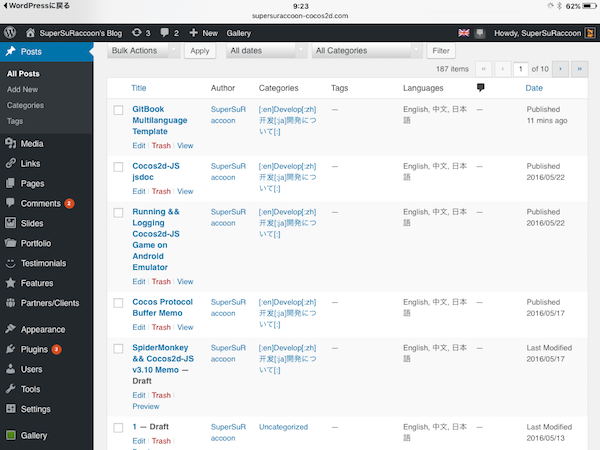
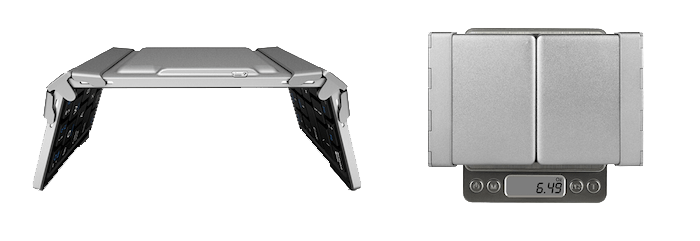

# iPad 工作站解决方案

## 前言
在入手了我的第一台 `iPad Mini 1` 之后，我就一直寻找出门不带电脑，只带着 `iPad Mini` (非越狱) 来实现日常工作的方法。

对我而言，希望在iPad上进行的工作内容主要有:

- 编程
  - 敲代码
  - 运行
  - 部署
  - 调试


- 博客
  - 写文章
  - 发布
  - 管理


## 编程

作为一名程序员，我现在的主要编码内容分配如下 :

-   80% 游戏开发
    -   80% 客户端
    -   20% 服务器
-   20% 软件 / 工具 开发

因此能在 iPad 上进行编码工作这是最基础也是最重要的需求之一。

### 项目同步

大多数情况下，我不会在 iPad 上发起一个新的项目，因为这操作起来会比较麻烦，绝大多数情况下，我都会在电脑端建立好项目的框架。

因此，我需要选择的 `App` 必须具有方便的将项目同步到 iPad 的功能。

我的选择是: [textastic](http://www.textasticapp.com/)。

 

它支持导入存放在 `Dropbox` 和 `iCloud Drive` 上的项目，对我来说这已经足够了。


### 编码

导入项目之后，自然就要开始编码了。基本上来说，只要带有语法高亮的文本编辑器都可以胜任这项工作，AppStore也是有无数的类似 `App` ，只要选择自己喜欢的就行了。
当然编码的工作可以在没有网络的情况下离线进行，只是这样就不能同步项目修改内容了。


### 运行

#### 本地

在编写完代码后，通常都会想要在本地看一下运行的效果。对于这个需求，大多数的代码编辑器都已经支持了。要记住的是，这种本地的运行，基本上是只支持简单的，使用`html` + `javascript` + `css`的前端Web项目。像是 `C++` 之类需要编译的项目自然是不可能的了。对我而言，可以离线的运行 `Cocos2d-JS` 游戏，这一点就已经很足够了。

textastic 就支持离线的`预览`编写好的项目:




#### 远程

这种情况下，我们通常需要将项目部署到某个服务器上，这一点我会在后面提到。


### 调试

可以运行项目自然不错，但是如果能够调试项目那就更棒了，至少是具备最简单的日志调试功能也行。

这一点通过使用[firebug-lite](http://getfirebug.com/firebuglite) 就可以轻松搞定。

只需要在项目的 `index.html` 中加入一行代码 :

```html
<script type="text/javascript" src="https://getfirebug.com/firebug-lite.js"></script>
```

这样在项目启动后，就会出现一个功能非常强大的调试工具了:



顺便说一下，textastic 自带了firebug-lite模块，我们不需要自己去添加，只需要在运行项目的时候，从菜单项中选择开启即可，这一点非常的方便。


### 版本控制

将项目存放在 `Dropbox` 或是 `iCloud Drive` 上是一个选择，但是大部分情况下我们还是习惯使用类似 GitHub具有版本控制的服务器上。

因此，我们需要一款 `App` 来帮助我们和存放版本服务器上的项目打交道。

试过一些不同的 `App` 后，我最终选择了 [Working Copy, Git on iOS](http://workingcopyapp.com/).



首先它的功能很完善 :

-   init
-   Clone
-   Push / Commit (Paid)
-   Fetch
-   Diff
-   Merge

而且这些操作的进行方式也是非常的直观方便。

其次，它自带的代码编辑器以及预览运行效果的功能，也是十分的强大，相比 textastic 可能就是虚拟键盘处于下风。

最后，它可以和 `textastic` 完美的联动。 我可以将导入的Git项目的某个文件，在 `textastic` 中打开，编辑，返回`WorkingCopy`后，刚才的修改就已经自动同步了。接下来我就只需要 diff / commit / push就完事了，非常的方便。


### 远程仓库

前面说过，一些基于Web的前端项目可以使用本地运行的方式来预览效果，但是对于一些服务器的项目如基于`PHP`, `Python` 或是 `node.js`的项目，我们需要将其部署到服务器上，并且安装配套环境后，才可以运行。

如果你有自己的服务器，并且有root权限，那么这就是很简单的事情，你只需要有一款好的 FTP/SSH App 就万事大吉了，比如 [prompt 2](https://www.panic.com/prompt/).

如果你没有自己的服务器的话，其实可以借助一些的 [PaaS](https://en.wikipedia.org/wiki/Platform_as_a_service) 例如 :

-   [Heroku](https://www.heroku.com/)
-   [Google App Engine](https://cloud.google.com/appengine/)
-   [Amazon Web Services](http://aws.amazon.com/)
-   [Sina App Engine](http://www.sinacloud.com/)
- 	...

来实现运行服务器端程序的需求。

具体方式，请阅读第二章中创建一个基于 `Node.js` + `Express` + `Heroku` 的 `Hello World` 项目的方法。

在创建完之后，我们同样可以将其使用 `Working Copy` 克隆，然后进行修改，diff / commit / push。


## 博客

除了编程之外，对我而言另一个需求，就是写博客。我喜欢记录开发中学到的东西，并将其和他人分享。


### Markdown

这是当下很流行的写技术文章的方式，同样的在 AppStore 中也有非常多的优秀 App。

我的个人选择是[editorial](http://omz-software.com/editorial/).

 

对我而言除去优秀的编辑能力外，它还具有这些我需要的功能 :

-   Workflow Automation
-   Python Scripting
-   Fountain Mode

最重要的一点，`Working Copy` 和 `editorial`也可以完美的联动工作。

顺便提一下，在 `Mac OSX` 上我最爱的 markdownb编辑器是[typora](http://www.typora.io/)。

 

### GitBook

[GitBook](https://www.gitbook.com/@supersuraccoon/) 是我发布编写好的文章的一个选择。

我通常会把 GitBook 对应书籍内容的代码存放在`GitHub`上。

>   [这里有一篇我写的相关文章](https://www.gitbook.com/book/supersuraccoon/gitbook_multilanguage_template/details).

对我而言个的工作流程是:

-   将 `GitBook` 书籍对应的在`GitHub`上的仓库使用`Working Copy`克隆到本地
-   使用 `editorial` 编写 markdown
-   Diff / Commit / Push
-   通过 `Safari` 确认编写的效果，因为目前还没有什么手机版的`GitBook` App


### Wordpress

除了 `GitBook` 之外，我还有一个自己的[独立Wordpress博客](http://www.supersuraccoon-cocos2d.com)，自然我也会选择把文章发布在那里。

通常我是用官方的 [Wordpress](https://itunes.apple.com/us/app/wordpress/id335703880?mt=8) app 来管理我的博客。



在编写发布帖子的时候，使用其中的 `Wp-Admin` 功能，其实也就是在浏览器中进行管理，因为毕竟Wordpress中使用了很多三方插件，使用官方内置的发布帖子的方式还是不方便的。

 


## 硬件

不论 App 自带的虚拟键盘改造的有多么优秀，永远比不上一个实体键盘。想要更有效率的编程或是写文章，一个键盘还是不可或缺的。

对我来说选择键盘的第一要求是便于携带，第二当然是打字手感。

我的选择是一款三折叠的蓝牙键盘，支持很多操作系统，手感也很不错，[推荐一下](http://www.iectechnology.com/product/best-ultra-slim-mini-wireless-foldable-bluetooth-keyboard.html)。

 


